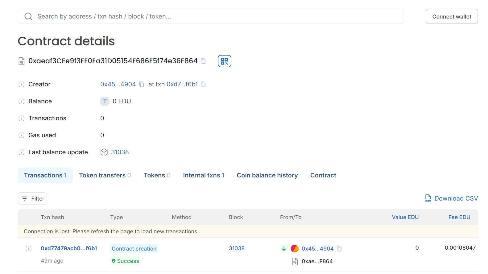

## Vision

The WorkoutApp is a blockchain-based application designed to help users track and manage their workout routines efficiently. By leveraging the power of smart contracts, the platform ensures transparency, immutability, and reliability in storing workout data. This project aims to provide fitness enthusiasts with a decentralized platform where they can log, store, and analyze their workout routines while earning rewards for their efforts.

## Contract Address

Blockchain: Ethereum
Contract Address: 0xaeaf3CEe9f3FE0Ea31D05154F686F5f74e36F864

## Functions

importWorkoutRoutines(string memory _csvData)
Description: This function allows the contract owner to import workout routines from a CSV string. The data is split into individual rows, validated, and stored in the workoutRoutines mapping.
## Parameters:

_csvData: A string containing the CSV data with workout routines.
split(string memory _str, string memory _delimiter)
Description: Helper function that splits a string into an array of substrings based on a delimiter.
equals(string memory _a, string memory _b)
Description: Helper function that checks if two strings are equal.
substring(string memory _str, uint256 _start, uint256 _end)
Description: Helper function that extracts a substring from a string based on start and end indices.
stringToUint(string memory _str)
Description: Helper function that converts a string to a uint256.
## Future Scope

User Interaction: Implement user registration and the ability to log individual workouts, allowing users to track their personal fitness progress.
Reward System: Integrate a reward system that provides tokens or incentives to users for completing workouts.
Mobile Integration: Develop a mobile application that interacts with the smart contract, making it easier for users to manage their fitness routines on the go.
Data Analytics: Introduce analytics and reporting features to provide users with insights into their workout habits and progress over time.
Social Features: Implement social sharing features, allowing users to challenge friends and share achievements on social media platforms.
## Contact Information

For more information or any queries, feel free to contact me:

# Name: Beka A Zhimomi
# Email: bekazhimo1@gmail.com
# GitHub: https://github.com/BekaAZhimomi